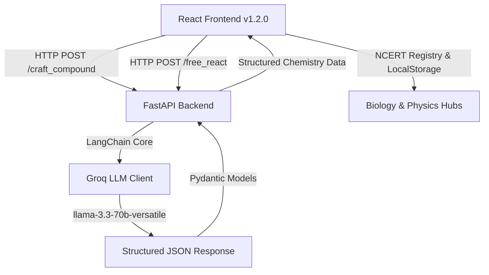

# EducationAI-Games 🎓🧪🔬✨


EducationAI-Games is a premium, interactive, AI-powered STEM learning platform designed for students from Grade 1 to High School (NCERT Class 9 & 10). It blends gamified learning with advanced Artificial Intelligence and high-fidelity HTML5 visual physics, chemistry, and biology simulators to teach core academic subjects—ranging from foundational math and literacy for early grades to complex geometry, AI chemical synthesis, interactive physics laboratories, and interactive NCERT anatomical diagram hubs.

---

## 🏗️ Project Architecture

The application is structured as a monorepo featuring a high-performance React 19 frontend and a FastAPI backend for AI chemical simulations:



- **Frontend**: Built using [React 19](file:///d:/GMS Work/EducationAI-Games/package.json#L17) & [Vite 8](file:///d:/GMS Work/EducationAI-Games/package.json#L31), styled with [Tailwind CSS v4](file:///d:/GMS Work/EducationAI-Games/package.json#L14) and enhanced with fluid micro-animations via [Framer Motion](file:///d:/GMS Work/EducationAI-Games/package.json#L15).
- **Backend**: Built with [FastAPI](file:///d:/GMS Work/EducationAI-Games/Backend/pyproject.toml#L9), powered by [LangChain](file:///d:/GMS Work/EducationAI-Games/Backend/pyproject.toml#L10) and [Groq LLM API](file:///d:/GMS Work/EducationAI-Games/Backend/pyproject.toml#L11) (`llama-3.3-70b-versatile`) to generate dynamic, educational chemistry feedback and reaction analyses.

---

## 🎮 Game Suite & Grade Breakdown

The games are organized by target grade level in [src/App.jsx](file:///d:/GMS Work/EducationAI-Games/src/App.jsx) and managed through the central dashboard [src/Components/Land.jsx](file:///d:/GMS Work/EducationAI-Games/src/Components/Land.jsx):

### 🦄 Grade 1: Foundational Skills
*   **Counting Game** ([Count.jsx](file:///d:/GMS Work/EducationAI-Games/src/Components/Grade 1/Count.jsx)): A tactile dragging game. Students drag apples into a basket to match random targets across multiple difficulty levels (e.g., Level 1: 1–10, Level 2: 10–20).
*   **Alphabet Tracing** ([Tracing.jsx](file:///d:/GMS Work/EducationAI-Games/src/Components/Grade 1/Tracing.jsx)): An interactive canvas-based letter/number tracing game. Powered by a custom geometry engine ([tracingEngine.js](file:///d:/GMS Work/EducationAI-Games/src/Components/Grade 1/engine/tracingEngine.js)) that tracks mouse/touch paths, calculates matching accuracy via [accuracyChecker.js](file:///d:/GMS Work/EducationAI-Games/src/Components/Grade 1/engine/accuracyChecker.js), and offers guide cues.

### 🐸 Grade 2: Basic Math & Language
*   **Vocabulary Crossword** ([Crossword.jsx](file:///d:/GMS Work/EducationAI-Games/src/Components/Grade2/Crossword.jsx)): An interactive grid-building word game. Scrambles letters into an interactive bank allowing kids to solve hints with sound feedback.
*   **Sentence Strip** ([SentenceStrip.jsx](file:///d:/GMS Work/EducationAI-Games/src/Components/Grade2/SentenceStrip.jsx)): Sentence-ordering drag-and-drop puzzles that offer structured levels of difficulty (e.g., picture clues vs. text-only).
*   **The Hopper** ([Hopper.jsx](file:///d:/GMS Work/EducationAI-Games/src/Components/Grade2/Hopper.jsx)): A gamified math frog game. Students solve arithmetic problems (add, subtract, missing addends) by hopping along number lines up to 100.
*   **Distance Finder** ([Distance.jsx](file:///d:/GMS Work/EducationAI-Games/src/Components/Grade2/Distance.jsx)): An interactive ruler game where kids calculate the distance between points on a dynamic number line.

### 📐 Grade 3: Intermediate Math & Spelling
*   **Sentence Builder** ([SentenceBuilder.jsx](file:///d:/GMS Work/EducationAI-Games/src/Components/Grade3/SentenceBuilder.jsx)): Helps students construct complex sentences utilizing parts of speech (nouns, verbs, adjectives).
*   **Missing Word** ([MissingWord.jsx](file:///d:/GMS Work/EducationAI-Games/src/Components/Grade3/MissingWord.jsx)): Reading comprehension fill-in-the-blanks using context clues.
*   **Area Builder** ([AreaBuilder.jsx](file:///d:/GMS Work/EducationAI-Games/src/Components/Grade3/AreaBuilder.jsx)): Interactive spatial math game where students click/drag grid blocks to build shapes that match a target area.
*   **Grid Splitter** ([GridSplitter.jsx](file:///d:/GMS Work/EducationAI-Games/src/Components/Grade3/GridSplitter.jsx)): Visual division of geometric grids to teach fractions and equal shares.
*   **Missing Side** ([MissingSide.jsx](file:///d:/GMS Work/EducationAI-Games/src/Components/Grade3/MissingSide.jsx)): Geometry solver where students compute the lengths of unknown sides of polygons given perimeters.

### 📊 Grade 4: Advanced Arithmetic & Logic
*   **Picture Match** ([PictureMatch.jsx](file:///d:/GMS Work/EducationAI-Games/src/Components/Grade4/PictureMatch.jsx)): Visual vocabulary flash-card matching game.
*   **Sequencing Tiles** ([SequencingTiles.jsx](file:///d:/GMS Work/EducationAI-Games/src/Components/Grade4/SequencingTiles.jsx)): Logical flow and sequencing puzzles requiring users to arrange instructions in order.
*   **Fraction Pie** ([FractionPie.jsx](file:///d:/GMS Work/EducationAI-Games/src/Components/Grade4/FractionPie.jsx)): Interactive pie slices where students slice and paint visual segments to discover equivalent fractions.
*   **Fraction Compare** ([FractionCompare.jsx](file:///d:/GMS Work/EducationAI-Games/src/Components/Grade4/FractionCompare.jsx)): Side-by-side comparison of fraction structures with interactive visualization sliders.
*   **Number Arrange** ([NumberArrange.jsx](file:///d:/GMS Work/EducationAI-Games/src/Components/Grade4/NumberArrange.jsx)): Fast sorting and ordering games involving decimals and large integers.

---

## 🧬 Interactive Biology Explorer & NCERT Suite (NEW in v1.2.0)

The Biology platform ([BioHub.jsx](file:///d:/GMS Work/EducationAI-Games/src/Components/Biology/BioHub.jsx) & [BiologyModule.jsx](file:///d:/GMS Work/EducationAI-Games/src/Components/Biology/BiologyModule.jsx)) offers a comprehensive, curriculum-aligned interactive laboratory for NCERT Class 9 & Class 10 Biology:

1.  **NCERT Interactive Diagram Hub & Quiz Engine** ([NCERTDiagramHub.jsx](file:///d:/GMS Work/EducationAI-Games/src/Components/Biology/components/NCERTDiagramHub.jsx) & [biologyRegistry.js](file:///d:/GMS Work/EducationAI-Games/src/data/biologyRegistry.js)):
    *   **Unit 1 — The Fundamental Unit of Life**: Interactive anatomical breakdown of Animal Cell, Plant Cell, Mitosis (Equational Division), Meiosis I (Reductional Division), and Meiosis II (Equational Division).
    *   **Unit 2 — Tissues**: High-resolution diagrams covering Meristematic Tissues (Apical, Intercalary, Lateral), Permanent Plant Tissues (Parenchyma, Collenchyma, Sclerenchyma, Xylem, Phloem), Epithelial Tissues (Stratified Squamous, Ciliated Columnar, Glandular), Muscular Tissues (Striated, Smooth, Cardiac), Connective Tissues (Blood, Bone, Cartilage, Areolar, Adipose), and Nervous Tissue Architecture (Cyton, Dendrites, Axon, Synapse).
    *   **Unit 3 — Life Processes**: Interactive systems covering Human Digestive System (Alimentary Canal), Respiration, Circulation & Heart, and Excretion & Nephron structure.
    *   **Dual Interactive Modes**:
        *   **Study Mode**: Hover/click pin-point anatomical targets to inspect NCERT definitions, key physiological functions, and high-yield CBSE exam tips via the right drawer ([InfoCard.jsx](file:///d:/GMS Work/EducationAI-Games/src/Components/Biology/InfoCard.jsx)).
        *   **Memory & Spatial Recall Test Mode**: Gamified quizzing that prompts students to identify structures on un-labeled diagrams with live scoring, accuracy percentages, and persistent topic mastery tracked via `localStorage`.
2.  **Cell Sandbox & Virtual Organelle Simulator** ([CellSandbox.jsx](file:///d:/GMS Work/EducationAI-Games/src/Components/Biology/components/CellSandbox.jsx), [InteractiveAnimalCell.jsx](file:///d:/GMS Work/EducationAI-Games/src/Components/Biology/InteractiveAnimalCell.jsx), [InteractivePlantCell.jsx](file:///d:/GMS Work/EducationAI-Games/src/Components/Biology/InteractivePlantCell.jsx)):
    *   Zoomable, high-fidelity canvas renderings of eukaryotic plant and animal cell structures.
    *   Interactive organelle spotlighting (Nucleus, Nucleolus, Rough/Smooth ER, Mitochondria, Golgi Apparatus, Lysosomes, Chloroplasts, Vacuoles, Centrioles).
    *   Side-by-side comparative analysis of structural differences between plant and animal cells.

---

## 🧪 Interactive Chemistry Suite & Educator Tooling

The Chemistry platform provides high school students with advanced chemical synthesis tools alongside teacher administration features:

1.  **Interactive Periodic Table** ([PeriodicTable.jsx](file:///d:/GMS Work/EducationAI-Games/src/Components/Chemistry/PeriodicTable.jsx)):
    *   Custom color schemes mapping chemical categories (Halogens, Transition Metals, Noble Gases, etc.).
    *   Contains the **Atomic Model Simulator** ([AtomicModelSimulator.jsx](file:///d:/GMS Work/EducationAI-Games/src/Components/Chemistry/AtomicModelSimulator.jsx)), providing real-time rendering of electron shells (Bohr models) with orbiting electrons.
2.  **Chemistry AI Virtual Lab** ([Lab.jsx](file:///d:/GMS Work/EducationAI-Games/src/Components/Chemistry/Lab/Lab.jsx)):
    *   **Compound Crafter Mode**: Select elements from the periodic table, specify target chemical formulas, and press "Craft". The FastAPI server computes IUPAC names, balanced equations, bonding types, molar mass, safety hazards, real-world uses, and educational fun facts.
    *   **Free Lab Mode**: Combine chemical substances (such as `Na`, `Cl2`, `H2O`, `HCl`) in a digital beaker. The AI determines reaction feasibility, sensory descriptions (color shifts, gas release, precipitation, flame), reaction thermodynamics, and handling safety.
3.  **Teacher Custom Question Builder** ([TeacherQuestionBuilder.jsx](file:///d:/GMS Work/EducationAI-Games/src/Components/Chemistry/Lab/TeacherQuestionBuilder.jsx) — **NEW in v1.2.0**):
    *   Educator portal accessible via `/chemistry/lab/teacher`.
    *   Allows teachers to create custom synthesis challenges, set required reactants, specify hints, and save custom lab assignments directly to local storage for student practice.

---

## ⚡ Interactive Physics Suite

The Physics platform is a laboratory environment mapped to Grade 9 & 10 (NCERT syllabus) concepts. Managed through the central dashboard **Physics Hub** ([PhysicsHub.jsx](file:///d:/GMS Work/EducationAI-Games/src/Components/Physics/PhysicsHub/PhysicsHub.jsx)):

1.  **Motion Runway (Projectile Motion Lab)** ([ProjectileMotion.jsx](file:///d:/GMS Work/EducationAI-Games/src/Components/Physics/ProjectileMotion/ProjectileMotion.jsx)):
    *   **Interactive Parameters**: Adjust launch speed, angle, elevation height, and projectile mass.
    *   **Vector Overlays & Telemetry**: Live rendering of total velocity vector, horizontal ($v_x$) and vertical ($v_y$) components, gravity vectors, and real-time kinetic vs. potential energy distribution.
    *   **Environment Presets**: Instant switching between Earth, Moon, Mars, Jupiter, or custom gravity.
2.  **Friction Slide (Friction Incline Lab)** ([FrictionSimulator.jsx](file:///d:/GMS Work/EducationAI-Games/src/Components/Physics/FrictionSimulator/FrictionSimulator.jsx)):
    *   **Incline Mechanics & Vector Diagrams**: Adjust block mass, slope angle, push force, and observe real-time vectors ($F_g, F_N, F_f, F_a$).
    *   **Coefficient Presets**: Custom static ($\mu_s$) and kinetic ($\mu_k$) friction coefficients with material presets (Ice, Wood, Metal, Rubber).
3.  **Sound Tank (Sound Wave Tank)** ([SoundWaveTank.jsx](file:///d:/GMS Work/EducationAI-Games/src/Components/Physics/SoundWave/SoundWaveTank.jsx)):
    *   **Wave Emitter & Mediums**: Control frequency, amplitude, and initial phase. Medium speeds adjust dynamically (Air, Water, Steel, and temperature variations).
    *   **Boundaries & Particle Simulation**: Toggle between Rigid (phase inversion) and Free boundaries, with dual views for pressure graph and particle compression/rarefaction.
4.  **Circuit Sandbox (Circuit Builder)** ([CircuitBuilder.jsx](file:///d:/GMS Work/EducationAI-Games/src/Components/Physics/PhysicsHub/components/CircuitBuilder.jsx)):
    *   **Interactive Grid Sandbox**: Drag, place, and connect batteries, switches, resistors, light bulbs, wires, and fuses.
    *   **Nodal Solver & Voltmeter**: Computes voltages, currents, and power drops using Kirchhoff's laws. Interactive Red/Black Voltmeter probes measure potential differences across junctions.
    *   **Fuse Safety & Guided Missions**: Interactive fuses melt under overload; guided missions cover Ohm's Law and series/parallel configurations.
5.  **Optics Lab (Mirror & Eye Lab)** ([OpticsMirrorLab.jsx](file:///d:/GMS Work/EducationAI-Games/src/Components/Physics/PhysicsHub/OpticsMirrorLab.jsx)):
    *   **Ray Bench & Snell's Law**: Place Concave/Convex Lenses and Mirrors, adjust focal lengths, trace principal rays, verify Snell's Law, and simulate Total Internal Reflection (TIR).
    *   **Eye Clinic**: Diagnose Myopia and Hypermetropia defects, applying corrective lenses with real-time diopter power adjustments ($D$).
6.  **Formula Overlays & Theme Support** ([FormulaOverlay.jsx](file:///d:/GMS Work/EducationAI-Games/src/Components/Physics/FormulaOverlay.jsx) — **NEW in v1.2.0**):
    *   Real-time formula display overlaying live simulation canvases.
    *   Integrated dark/light theme switching across the Physics Hub dashboard.

---

## ⚙️ Tech Stack & Requirements

### Frontend Dependencies ([package.json](file:///d:/GMS Work/EducationAI-Games/package.json))
- **React 19 & React DOM 19** (`^19.2.6`)
- **Vite 8** (`^8.0.12`)
- **Tailwind CSS v4** (`^4.3.0`)
- **Framer Motion** (`^12.40.0`)
- **Lucide React & Iconify** (`^1.17.0`, `^6.0.2`)
- **React Router Dom v7** (`^7.17.0`)
- **Project Version**: `1.2.0`

### Backend Dependencies ([pyproject.toml](file:///d:/GMS Work/EducationAI-Games/Backend/pyproject.toml))
- **FastAPI** (`>=0.138.1`)
- **LangChain Core** (`>=1.4.8`)
- **LangChain Groq** (`>=1.1.3`)
- **Python Dotenv** (`>=0.9.9`)
- **Requires Python**: `>=3.14`
- **Backend Version**: `1.2.0`

---

## 🚀 Setup & Local Running Guide

### 1. Backend Setup
Navigate to the `Backend` directory and ensure Python 3.14+ is installed.

```bash
cd Backend
```

Initialize your environment variables. Create a `.env` file in the `Backend` directory containing your Groq API key:
```env
GROQ_API_KEY=your-groq-api-key-here
```
*(Ensure `.env` is ignored by Git, which is configured in [.gitignore](file:///d:/GMS Work/EducationAI-Games/.gitignore).)*

Install dependencies and start the FastAPI dev server:
```bash
# Using UV (Recommended)
uv run fastapi dev main.py
```
The server will boot by default on: `http://localhost:8000`

### 2. Frontend Setup
From the project workspace root, install npm packages:
```bash
npm install
```

Start the Vite development server:
```bash
npm run dev
```
The application dashboard is available at: `http://localhost:5173`

---

## 🗺️ Route Directory Summary

| Route | Component | Subject / Grade | Description |
| :--- | :--- | :--- | :--- |
| `/` | `HeroHighlight` | Portal | Main Application Landing Page |
| `/games` | `Land` | Portal | Interactive Grade Level Dashboard |
| `/grade1/count` | `Count` | Grade 1 Math | Apple Counting Game |
| `/grade1/tracing` | `Tracing` | Grade 1 Literacy | Letter/Number Tracing Canvas |
| `/grade2/crossword` | `Crossword` | Grade 2 Language | Scrambled Word Crossword |
| `/grade2/sentence-strip` | `SentenceStrip` | Grade 2 Literacy | Sentence Ordering Puzzles |
| `/grade2/hopper` | `Hopper` | Grade 2 Math | Frog Number Line Math |
| `/grade2/distance` | `Distance` | Grade 2 Math | Ruler Distance Measurement |
| `/grade3/sentence-builder` | `SentenceBuilder` | Grade 3 Language | Parts of Speech Builder |
| `/grade3/missing-word` | `MissingWord` | Grade 3 Reading | Context Clues Fill-in-the-Blank |
| `/grade3/area-builder` | `AreaBuilder` | Grade 3 Geometry | Spatial Area Block Builder |
| `/grade3/grid-splitter` | `GridSplitter` | Grade 3 Fractions | Grid Division Fractions |
| `/grade3/missing-side` | `MissingSide` | Grade 3 Geometry | Polygon Perimeter Solver |
| `/grade4/picture-match` | `PictureMatch` | Grade 4 Vocabulary | Visual Flashcard Match |
| `/grade4/sequencing-tiles` | `SequencingTiles` | Grade 4 Logic | Instruction Flow Ordering |
| `/grade4/fraction-pie` | `FractionPie` | Grade 4 Fractions | Pie Slicing Equivalent Fractions |
| `/grade4/fraction-compare` | `FractionCompare` | Grade 4 Fractions | Side-by-side Fraction Comparer |
| `/grade4/number-arrange` | `NumberArrange` | Grade 4 Math | Decimal & Integer Sorting |
| `/chemistry/periodic-table` | `PeriodicTable` | High School Chemistry | Interactive Periodic Table & Bohr Model |
| `/chemistry/lab` | `Lab` | High School Chemistry | AI Virtual Lab (Compound Crafter & Free Lab) |
| `/chemistry/lab/teacher` | `TeacherQuestionBuilder` | High School Chemistry | Teacher Custom Reaction Challenge Builder |
| `/physics/hub` | `PhysicsHub` | High School Physics | Unified Physics Suite Dashboard |
| `/physics/lab` | `PhysicsLab` | High School Physics | Projectile Motion Runway |
| `/physics/friction` | `FrictionSimulator` | High School Physics | Friction Incline Slide |
| `/physics/sound` | `SoundWaveTank` | High School Physics | Sound Wave Propagation Tank |
| `/biology/hub` | `BioHub` | NCERT Bio Class 9–10 | Bio Hub (Diagrams & Cell Sandbox) |
| `/biology/diagram-hub` | `BiologyModule` | NCERT Bio Class 9–10 | Interactive Anatomical Diagram & Quiz Hub |

---

## 🔒 Security Best Practices
*   **Environment Ignored**: The `.env` variables containing secrets like `GROQ_API_KEY` are blocked in Git via the project [.gitignore](file:///d:/GMS Work/EducationAI-Games/.gitignore).
*   **Strict CORS Policy**: Staged in [main.py](file:///d:/GMS Work/EducationAI-Games/Backend/main.py#L14-L20) to only accept requests originating from authorized frontend hosts (`http://localhost:5173`).