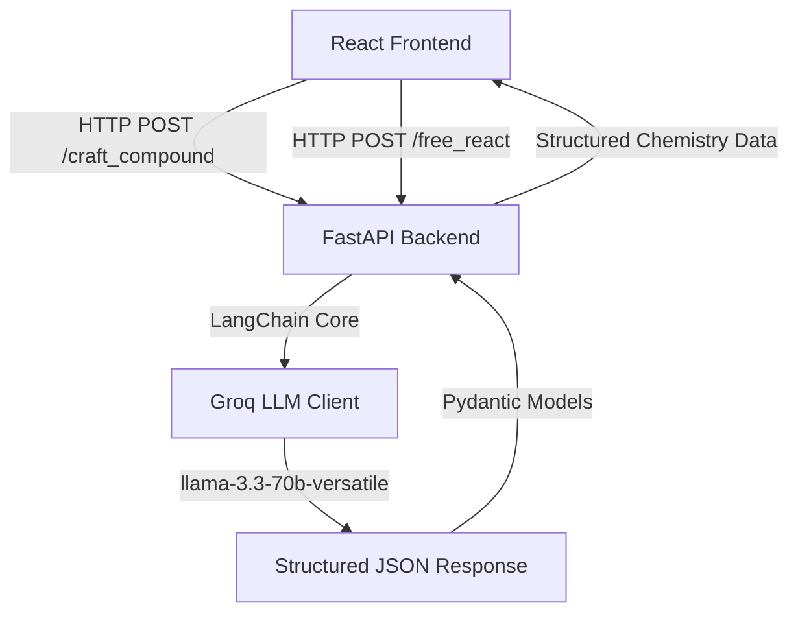

# EducationAI-Games 🎓🧪✨

EducationAI-Games is a premium, interactive, AI-powered learning platform designed for students from Grade 1 to High School. It blends gamified learning with advanced Artificial Intelligence to teach core academic subjects—ranging from foundational math and literacy for early grades to complex geometry, fractions, and an AI-powered Virtual Chemistry Laboratory.

---

## 🏗️ Project Architecture

The application is structured as a monorepo with a high-fidelity React frontend and a robust FastAPI backend for AI chemical simulations:



- **Frontend**: Built using [React 19](file:///d:/GMS Work/EducationAI-Games/package.json#L17) & [Vite 8](file:///d:/GMS Work/EducationAI-Games/package.json#L31), styled with [Tailwind CSS v4](file:///d:/GMS Work/EducationAI-Games/package.json#L14) and enhanced with fluid micro-animations via [Framer Motion](file:///d:/GMS Work/EducationAI-Games/package.json#L15).
- **Backend**: Built with [FastAPI](file:///d:/GMS Work/EducationAI-Games/Backend/pyproject.toml#L9), powered by [LangChain](file:///d:/GMS Work/EducationAI-Games/Backend/pyproject.toml#L10) and [Groq LLM API](file:///d:/GMS Work/EducationAI-Games/Backend/pyproject.toml#L11) (`llama-3.3-70b-versatile`) to generate dynamic, educational chemistry feedback.

---

## 🎮 Game Suite & Grade Breakdown

The games are organized by target grade level in [src/App.jsx](file:///d:/GMS Work/EducationAI-Games/src/App.jsx) and managed through the central dashboard [src/Components/Land.jsx](file:///d:/GMS Work/EducationAI-Games/src/Components/Land.jsx):

### 🦄 Grade 1: Foundational Skills
*   **Counting Game** ([Count.jsx](file:///d:/GMS Work/EducationAI-Games/src/Components/Grade 1/Count.jsx)): A tactile dragging game. Students drag apples into a basket to match random targets across multiple difficulty levels (e.g., Level 1: 1–10, Level 2: 10–20).
*   **Alphabet Tracing** ([Tracing.jsx](file:///d:/GMS Work/EducationAI-Games/src/Components/Grade 1/Tracing.jsx)): An interactive canvas-based letter/number tracing game. Powered by a custom geometry engine ([tracingEngine.js](file:///d:/GMS Work/EducationAI-Games/src/Components/Grade 1/engine/tracingEngine.js)) that tracks mouse/touch paths, calculates matching accuracy via [accuracyChecker.js](file:///d:/GMS Work/EducationAI-Games/src/Components/Grade 1/engine/accuracyChecker.js), and offers guide cues.

### 🐸 Grade 2: Basic Math & Language
*   **Vocabulary Crossword** ([Crossword.jsx](file:///d:/GMS Work/EducationAI-Games/src/Components/Grade2/Crossword.jsx)): An interactive grid-building word game. Scrambles letters into an interactive bank allowing kids to solve hints with sound feedback.
*   **Sentence Strip** ([SentenceStrip.jsx](file:///d:/GMS Work/EducationAI-Games/src/Components/Grade2/SentenceStrip.jsx)): Sentence-ordering drag-and-drop puzzles that offer structured levels of difficulty (e.g., picture clues vs. text-only).
*   **The Hopper** ([Hopper.jsx](file:///d:/GMS Work/EducationAI-Games/src/Components/Grade2/Hopper.jsx)): A gamified math frog game. Students solve arithmetic problems (add, subtract, missing addends) by hopping along number lines up to 100.
*   **Distance Finder** ([Distance.jsx](file:///d:/GMS Work/EducationAI-Games/src/Components/Grade2/Distance.jsx)): An interactive ruler game where kids calculate the distance between points on a dynamic number line.

### 📐 Grade 3: Intermediate Math & Spelling
*   **Sentence Builder** ([SentenceBuilder.jsx](file:///d:/GMS Work/EducationAI-Games/src/Components/Grade3/SentenceBuilder.jsx)): Helps students construct complex sentences utilizing parts of speech (nouns, verbs, adjectives).
*   **Missing Word** ([MissingWord.jsx](file:///d:/GMS Work/EducationAI-Games/src/Components/Grade3/MissingWord.jsx)): Reading comprehension fill-in-the-blanks using context clues.
*   **Area Builder** ([AreaBuilder.jsx](file:///d:/GMS Work/EducationAI-Games/src/Components/Grade3/AreaBuilder.jsx)): Interactive spatial math game where students click/drag grid blocks to build shapes that match a target area.
*   **Grid Splitter** ([GridSplitter.jsx](file:///d:/GMS Work/EducationAI-Games/src/Components/Grade3/GridSplitter.jsx)): Visual division of geometric grids to teach fractions and equal shares.
*   **Missing Side** ([MissingSide.jsx](file:///d:/GMS Work/EducationAI-Games/src/Components/Grade3/MissingSide.jsx)): Geometry solver where students compute the lengths of unknown sides of polygons given perimeters.

### 📊 Grade 4: Advanced Arithmetic & Logic
*   **Picture Match** ([PictureMatch.jsx](file:///d:/GMS Work/EducationAI-Games/src/Components/Grade4/PictureMatch.jsx)): Visual vocabulary flash-card matching game.
*   **Sequencing Tiles** ([SequencingTiles.jsx](file:///d:/GMS Work/EducationAI-Games/src/Components/Grade4/SequencingTiles.jsx)): Logical flow and sequencing puzzles requiring users to arrange instructions in order.
*   **Fraction Pie** ([FractionPie.jsx](file:///d:/GMS Work/EducationAI-Games/src/Components/Grade4/FractionPie.jsx)): Interactive pie slices where students slice and paint visual segments to discover equivalent fractions.
*   **Fraction Compare** ([FractionCompare.jsx](file:///d:/GMS Work/EducationAI-Games/src/Components/Grade4/FractionCompare.jsx)): Side-by-side comparison of fraction structures with interactive visualization sliders.
*   **Number Arrange** ([NumberArrange.jsx](file:///d:/GMS Work/EducationAI-Games/src/Components/Grade4/NumberArrange.jsx)): Fast sorting and ordering games involving decimals and large integers.

---

## 🧪 Interactive Chemistry Suite

The Chemistry platform is built to engage high school students in advanced scientific experiments:

1.  **Interactive Periodic Table** ([PeriodicTable.jsx](file:///d:/GMS Work/EducationAI-Games/src/Components/Chemistry/PeriodicTable.jsx)):
    *   Beautiful custom color schemes mapping chemical categories (Halogens, Transition Metals, Noble Gases, etc.).
    *   Contains the **Atomic Model Simulator** ([AtomicModelSimulator.jsx](file:///d:/GMS Work/EducationAI-Games/src/Components/Chemistry/AtomicModelSimulator.jsx)), providing real-time rendering of electron shells (Bohr models) with orbiting electrons.
2.  **Chemistry AI Virtual Lab** ([Lab.jsx](file:///d:/GMS Work/EducationAI-Games/src/Components/Chemistry/Lab/Lab.jsx)):
    *   **Compound Crafter Mode**: Pick items from the periodic table, select an attempted chemical formula, and press "Craft". The FastAPI server processes the input and returns structured compound details (IUPAC name, balanced equation, bonding types, molar mass, safety hazards, real-world uses, and educational fun facts).
    *   **Free Lab Mode**: Combine any substances (such as `Na`, `Cl2`, `H2O`, `HCl`) in a digital beaker. The AI determines whether a chemical reaction occurs, outputting sensory descriptions (colour changes, bubble releases, precipitation, flames), reaction types, energy levels (exothermic/endothermic), and safe handling information.

---

## ⚙️ Tech Stack & Requirements

### Frontend Dependencies ([package.json](file:///d:/GMS Work/EducationAI-Games/package.json))
- **React 19 & React DOM 19**
- **Vite 8** (Dev server and bundler)
- **Tailwind CSS v4** (Modern utility-first CSS engine)
- **Framer Motion** (Spring physics and layout transitions)
- **Lucide React & Iconify** (Icons library)
- **React Router Dom v7** (Client-side routing)

### Backend Dependencies ([pyproject.toml](file:///d:/GMS Work/EducationAI-Games/Backend/pyproject.toml))
- **FastAPI** (High performance ASGI server framework)
- **LangChain Core** (LLM orchestrator)
- **LangChain Groq** (Groq cloud client)
- **Python Dotenv** (Environment variables configuration reader)
- **Requires Python**: `>=3.14`

---

## 🚀 Setup & Local Running Guide

### 1. Backend Setup
Navigate to the `Backend` directory and ensure Python 3.14+ is installed.

```bash
cd Backend
```

Initialize your environment variables. Create a `.env` file in the `Backend` directory containing your Groq API key:
```env
GROQ_API_KEY=your-groq-api-key-here
```
*(Ensure `.env` is ignored by Git, which is configured in [.gitignore](file:///d:/GMS Work/EducationAI-Games/.gitignore).)*

Install dependencies and start the FastAPI dev server:
```bash
# Using UV (Recommended)
uv run fastapi dev main.py
```
The server will boot by default on: `http://localhost:8000`

### 2. Frontend Setup
From the project workspace root, install npm packages:
```bash
npm install
```

Start the Vite development server:
```bash
npm run dev
```
The application dashboard is available at: `http://localhost:5173`

---

## 🔒 Security Best Practices
*   **Environment Ignored**: The `.env` variables containing secrets like `GROQ_API_KEY` are blocked in Git via the project [.gitignore](file:///d:/GMS Work/EducationAI-Games/.gitignore).
*   **Strict CORS Policy**: Staged in [main.py](file:///d:/GMS Work/EducationAI-Games/Backend/main.py#L14-L20) to only accept requests originating from the authorized frontend host (`http://localhost:5173`).
